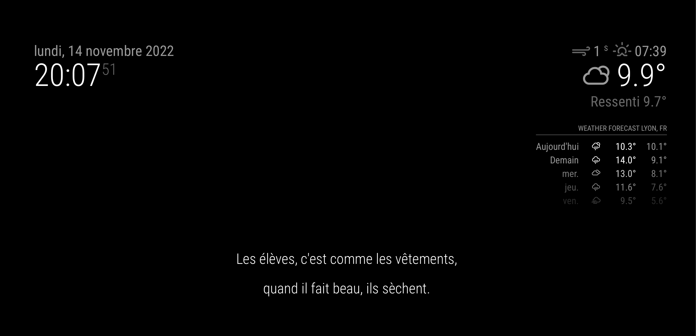

# MagicMirror² BlaguesAPI module
This is a module for `MagicMirror²`; the purpose of the module is to show you jokes from the french BlaguesAPI (https://www.blagues-api.fr).

## Installation
1.  Clone this repository into your MagicMirror `modules` folder.
2.  Edit your configuration file under `config/config.js` with the following configuration.
```
{
    module: 'MMM-BlaguesAPI',
    position: 'bottom_bar',
    type: {
        type: "random",
        fetchInterval: 60000,
		blaguesApiToken: "xxxxx"
    }
}
```

### Preview



## Configuration options

| Option                 | Description
|------------------------|-----------
| `type`          | The list of module names that are controlled by this module.<br>Possible values:<br>1.  `global`<br>2.  `dev`<br>3.  `dark`<br>4.  `limit`<br>5.  `beauf`<br>6.  `blondes`<br><br> **Type:** `string` <br>**Default value:** `random`
| `fetchInterval`| How often (in milliseconds) a new joke should be fetched.<br><br> **Type:** `number` <br>**Default value:** `60 * 1000`
| `blaguesApiToken`| Your API Token generated on https://www.blagues-api.fr<br><br> **Type:** `string`

#### Credits
MagicMirror²:   [MagicMirror²](https://github.com/MichMich/MagicMirror)   
BlaguesAPI:    [BlaguesAPI](https://www.blagues-api.fr/)
